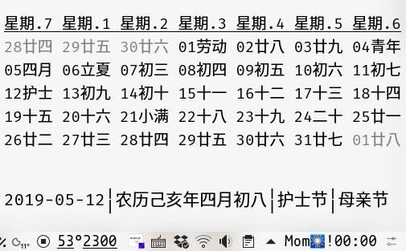

# k-argos-scripts

Self plugin repository for [Argos](https://github.com/p-e-w/argos) Gnome and [kargos](https://github.com/lipido/kargos) KDE.

## timelapse 🚌

+ This time you boot your System
+ Your time elapsed of this day, month, year
+ Time you spent on earth

## system info

Show CPU temperature, fan speed and Nvidia GPU temperature(when you are using Nvidia GPU).

Without using Nvidia GPU .

Using Nvidia GPU, such as `optirun python` .

`optirun` is for `Bumblebee`.

## Chinese Calendar [农历](https://en.wikipedia.org/wiki/Chinese_calendar)

在`KDE`面板显示农历。

如果今天是节日或节气，会在图片下方一行字的右侧继续显示。

在`script`中配置生日信息：`birthdays = {"0102": "Som"}`会从生日$4$天前开始在面板的`status bar`中额外显示（右侧为时间）：

+ `Som🎂┊` $4$天预警
+ `Som🎂┆` $3$天预警
+ `Som🎂╎` $2$天预警
+ `Som🎂'` $1$天预警
+ `Som🎂!` 当天预警

# Emoji meaning

+ 🚌: ported (there are some differences between mac and Linux for bash command) from [Bitbar plugin](https://github.com/matryer/bitbar-plugins) and improved
+ 🤔: bug don't know why

# Fonts

You need `Hack` and `mononoki` font.

# Refs

+ [Time](https://raw.githubusercontent.com/matryer/bitbar-plugins/master/Time/progress.1h.sh) 
+ [kotelnik/plasma-applet-thermal-monitor](https://github.com/kotelnik/plasma-applet-thermal-monitor)
+ [😈](https://emojipedia.org)
+ [〆](https://coolsymbol.com/line-symbols.html)
